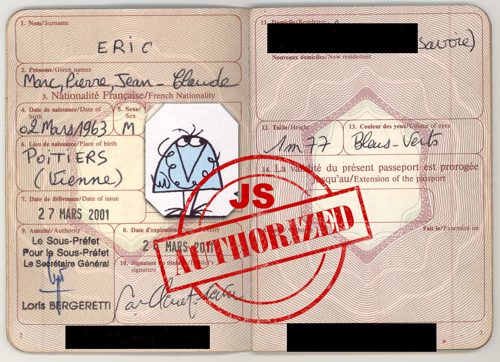

# Passeport pour le Javascriptan


Vous débarquez en terre inconnue **le Javascriptan**.
Je serai votre guide dans cette perilleuse traversée.
Suivez le guide en ces terres inconnues.



## Votre expédition

- [Sous le capot du navigateur](hardware/README.md)
- [Drôles de types](syntax/README.md)
- [Valeurs inaccessibles](syntax/scope.md)
- [Zone de turbulences](syntax/hot_topics.md)
- [Bienvenue en ES5](es5/README.md)
- [La déclarations des droits ES6](es6/README.md)
- [Fonctions flêchées](es6/fat_arrow.md)
- [Ton template en `String`](es6/string.md)
- [_Split_ ton code](es6/modularity.md)
- [L'`Object` sous toutes les coutures](es6/object.md)
- [Orienté objet](es6/oop.md)
- [Bibliographie](biblio.md)

## Evaluation préliminaire 

Avant de débuter le cours, faisons un rapide exercice de connaissances. 
Envoyez un mail dont l'objet est `[WEB2p2020] Evaluation javascript` à `eric.priou[@]hetic.net` en me précisant :

- Votre nom entier
- Votre email
- Votre compte github
- Une mini bio
- Une évaluation de vos compétences notées de A-F sur le développement back, front, l'UX/UI, et la gestion de projet.
- Une photo selfie

Plus le résultat à chacune des questions suivantes.
Vous avez 45 minutes.

- Pour le code ci-dessous, choisissez la bonne réponse parmi :

	- [ ] Ce sont des méthodes asynchrones
	- [ ] Ce sont des méthodes synchrones
	- [ ] Est correct, et permet d’aller jusqu’à que n est inférieur  à 3
	- [ ] Est correct, et permet d’aller jusqu’à que n soit inférieur ou égal à trois 
	- [ ] Est incorrect.

	
```js
var n = 0;
var x = 0;
while (n < 3 ) {
  n+;
 	x += n;
}
```


- Afin d’éviter une boucle infinie, il suffit de :

	- [ ] Une boucle ne peut pas être infinie
	- [ ] Il faut vérifier si notre boucle comporte une seconde condition. 
	- [ ] Il suffit de mettre « true » en argument.
	- [ ] Il suffit de mettre « false » en argument.
	- [ ] Il faut une condition de sortie

- Qu’elle est la valeur de `j` ?

```js
var i = 1;
var j = i;
i = i+1;
console.log(j);
```

- Qu’elle est la valeur de `j` ?

```js
var i = [1,2,3]; // [] défini un array (tableau) par référence grâce au =
var j = i;
i.push(4); // ajoute un élément en fin de tableau
console.log(j);
```

- Ce code génère t-il un erreur ? Pourquoi ?

```js
var prof = {
	nom:"eric";
};
console.log(prof.nom);
prof.matiere="js";
```

- Quel est l'opérateur de stricte équivalence ?
- Pourquoi ne pas utiliser de variables globales ?
Qu'est-ce qu'une variable globale ?
- Qu'est-ce qu'une fonction anonyme ? 


