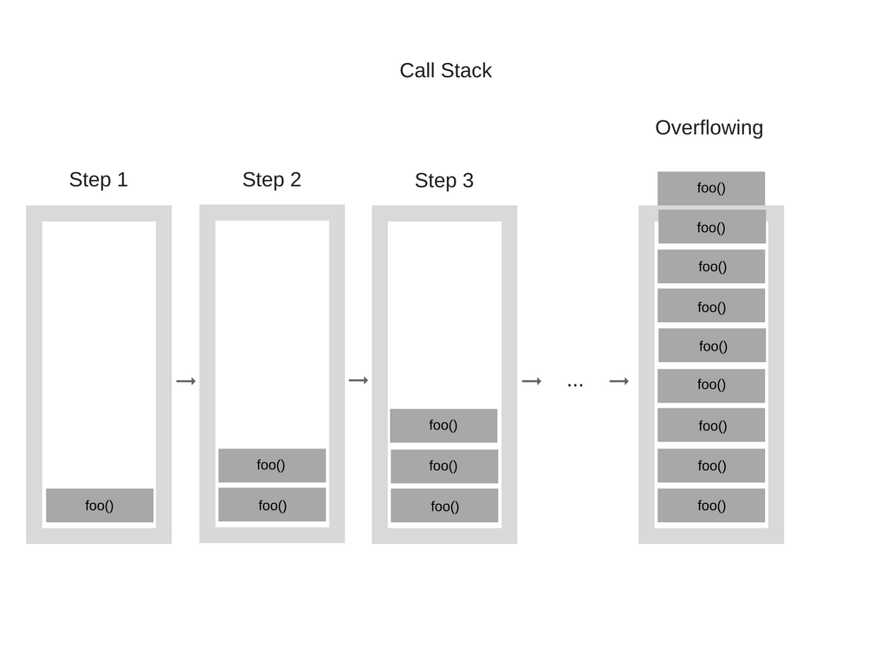

# Sous le capot du navigateur

## L'histoire pitoyable du javascript

[The weird history of javascript](https://www.youtube.com/watch?v=Sh6lK57Cuk4)

## Langage interprété

Au javascriptan, on utilise une machine pour se comprendre : la **Virtual Machine**.
Celle-ci, se charge de convertir notre code, en l'**interprétant à l'exécution** en code machine.
Tel un traducteur, cette interprétation permet au javascriptanais d'être compris par tous les systèmes.

**Il n'y a donc pas de phase de compilation**.

Le javascript s'évalue dans un contexte : celui du navigateur ou dans un environnement hôte comme avec node.js

Le moteur d'exécution javascript procède à une phase d'interprétation.
Autrefois lente, celle-ci a gagnée en rapidité grâce à la compilation JIT (*Just In Time*)

## Virtual Machine JS de navigateur

- [Chakra](http://en.wikipedia.org/wiki/Chakra_(JScript_engine)) (Microsoft Internet Explorer)
- [Nitro/JavaScript Core](http://en.wikipedia.org/wiki/WebKit#JavaScriptCore) (Safari)
- [Carakan](http://dev.opera.com/articles/view/labs-carakan/) (Opera)
- [SpiderMonkey](https://developer.mozilla.org/en-US/docs/SpiderMonkey) (Firefox)
- [V8](http://en.wikipedia.org/wiki/V8_(JavaScript_engine)) (Chrome, Chromium)

## Elastic racetrack

## Call stack

## Garbage Collector

- Contrairement à des langages de bas niveau, **la machine virtuelle alloue un espace mémoire automatiquement** à chaque variable définie.
- De plus, elle invoque un processus de nettoyage des références désallouées : le garbage collecting.
Les variables sont ainsi fréquemment supprimées de la RAM, sans que nous ayons a le prendre en charge.
- Il faudra toutefois se garder de créer des référénces circulaires, ou d'oublier de libérer certaines références, sous peine de créer des fuites de mémoire (*memory leak*)

[Garbage collector simulator](http://gskinner.com/blog/archives/2006/09/garbage_collect.html)

## Boîte à outils

